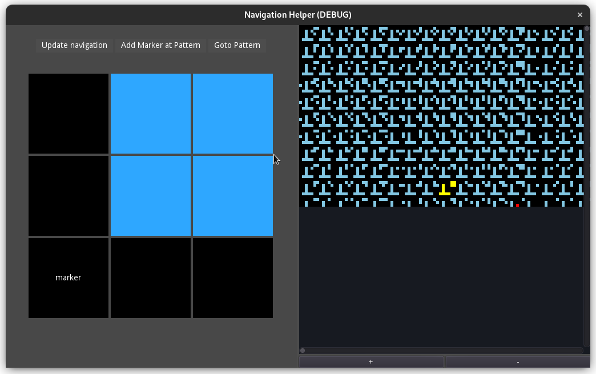

# Gui Application to support a STM navigation system
 - The gui is build with the Godot engine to achieve high performance rendering of the navigation pattern.

## Features
 - [x] render the navigation pattern exactly how they look on the sample.
 - [x] higlight the current location
 - [x] animate the preview window (left) to the current location
 - [x] add markers for points of interest
 - [ ] draw arrows and convert the arrows to steps for the xy-table
 - [ ] sophisticated marker system with adding/removing markers. Also notes for each marker should be supported

## The navigation system
It is based on a binary pattern that can be scanned and identified with the stm and is drawn onto a silicon sample using Electron beam lithography. \
This gui is supposed to help moving the tip to the right position by showing the current location and the calibrated xy input necessary to reach the target location.
